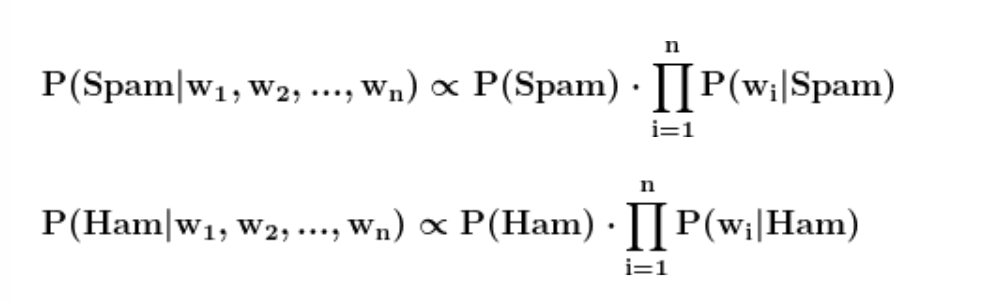

# AntiSpam ML Model
il progetto ha il ... di implementare il modello Naive Bayes senza l'utilizzo di librerie esterne.
Nello specifico il modello di ML che ha lo scopo di classifare se un messaggio è spam oppure ham.

# Dettagli sul progetto
Il modello implementato si basa sulla formula di Bayes, tale formula ci dice che:
 

 
dove P(A|B) indica la probabilità che l'evento A si verifichi sapendo che B si sia già verificato.
Utilizzando tale formula possiamo ricondurci a questo caso:

